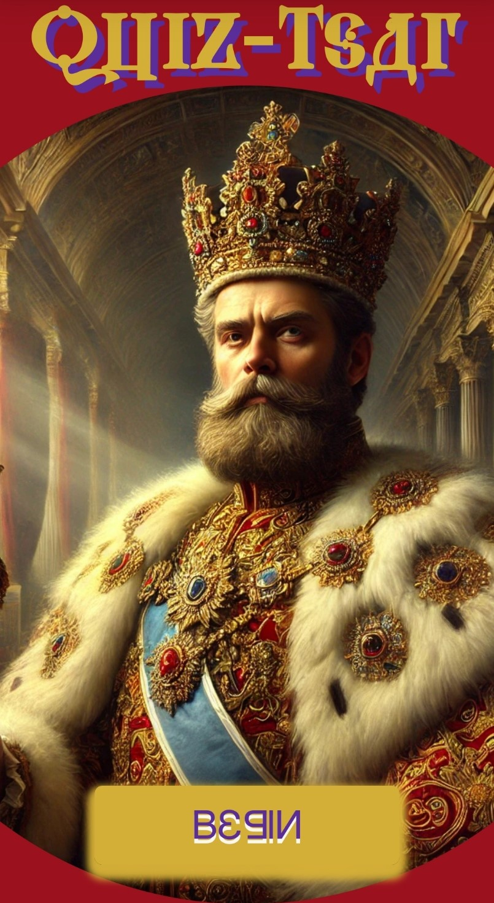
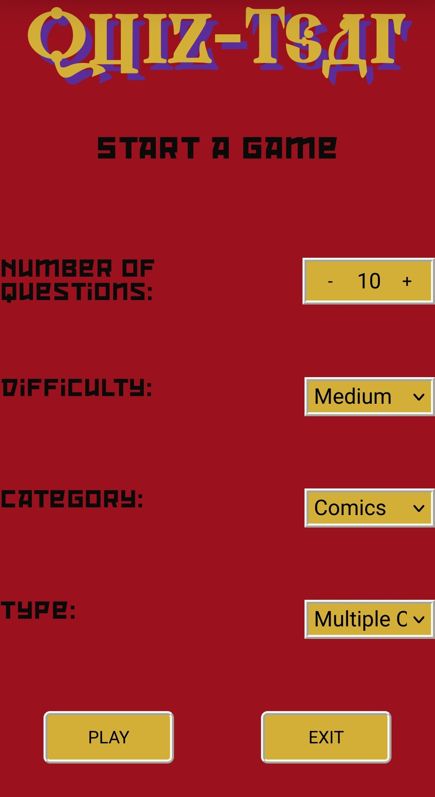

# Quiz-Tsar

## About the Project
While completing my Full Stack Development Course. I decided to create an independent React-Redux project. The title is a play on the word "quizzer". With "Quiz-Tsar" now being the title, I chose a Russian royalty aesthetic. AI was used to create the picture of the Tsar and give me a colour pallete to implement into the coding of this project. I had the project on hold until I had finished all my coursework. After I returned to the project I completed the API implementation, and the logic for the game. [Open Trivia Database](https://opentdb.com/) is being used for the trivia questions- I didn't write a single trivia question into the game myself.

## Features and User Interface Details
- Simple game configuration menu- enabling users to select number of questions, difficulty, category and question type ("multiple choice" or "true or false").
- Interactive buttons with click animations and hover effects.
- Feedback for correct and incorrect answers using pop up messages.
- Exit button prominently displayed for easy game termination.
- Game tracks user progress throughout game and displays results at the end.

## Game Logic
- App state updates as user selects options.
- App makes use of createAsyncThunk and URLSearchParams while calling the API to obtain questions.
- Questions are displayed one at a time, with large buttons for each multiple choice answer.
- Game state tracks progress for user feedback.

## Accessibility and Responsiveness
- Responsive design adapts to different screen sizes and orientations.
- ARIA roles and attributes used to enhance accessibility for screen readers.

## What was Learnt During Production
What I had to consider in this app was error handling, in case the API was used incorrectly or in case of any other errors. The app uses pop up boxes to give feedback in case of any such incidences. Utilization of the state managment of Redux enabled separation of concerns and could assist scalability of the game for added features in future. The use of async thunk in Redux was utilized for handling the API.

Another factor was a mobile-first approached. I wanted to prioritize a mobile-friendly interface for this app. When trying the app on my phone, as opposed to just used my brower's responsive mode, I still encounted minor challeneges regarding keeping button appropriate sizes for touchability and preventing overflow.

## Potential Future Developments
A potential future feature may be the option to play with friends. Another may be to create a game consisting of a number of quizzes where the game tracks and compares your scores between the quizzes you play. This was a feature I thought of in the beginning but chose not to implement at first.

## Screenshots

## Acknowledgements
  * [Open Trivia Database](https://opentdb.com/) - Credited for their API.
  * [1001 Fonts](https://www.1001fonts.com/) - Thanks for the awesome fonts!